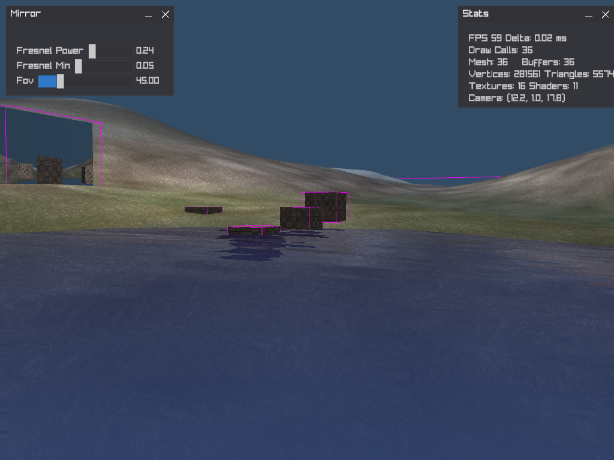
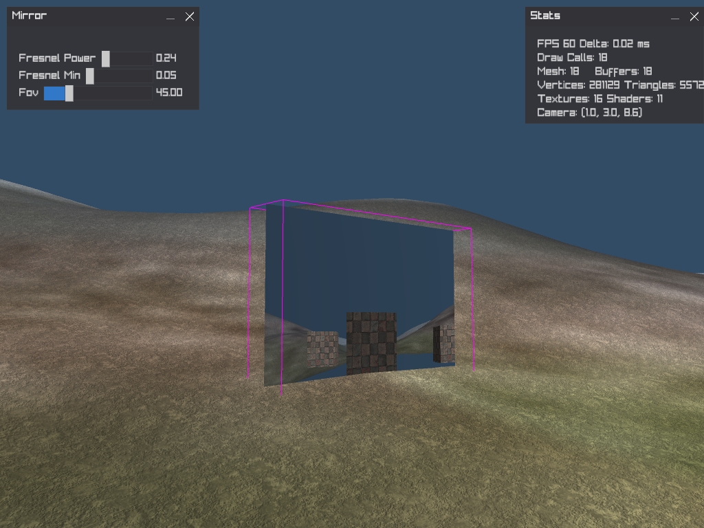

# 3D Game Engine

A lightweight 3D rendering engine built with OpenGL ES 3.0 and C++.

## Features

### Core Rendering
- Modern OpenGL ES 3.0 / WebGL 2.0 compatible
- Scene graph system with hierarchical transforms
- Multi-pass rendering pipeline
- Render target support (FBO)
- Multiple camera system

### Materials & Shaders
- Custom shader system (GLSL 300 es)
- Material system with multi-texture support
- Automatic shader compilation and linking
- Uniform management

### Mesh Generation
- Quad, Cube, Plane primitives
- Heightmap-based mesh generation
- Procedural terrain generation
- Custom mesh builder API

### Textures
- Multi-format support (PNG, JPG, TGA, etc)
- Pixmap class for image manipulation
- Texture manager with caching
- Filtering and wrapping modes

### Water Rendering
- Planar reflections
- Planar refractions
- Fresnel effect
- Animated bump mapping

### Input & GUI
- Mouse and keyboard input
- ImGui-style GUI system
- Debug rendering tools
- Stats display

## Requirements
- C++17
- OpenGL ES 3.0 / OpenGL 3.3+
- CMake 3.15+
- GLFW3

## License
MIT License

## Screenshots

 